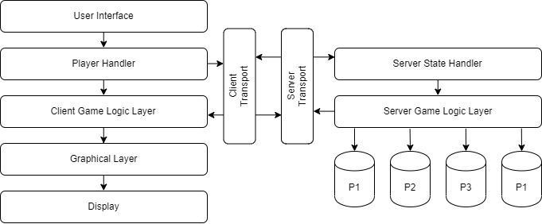

# **SHiP.io**
**_" A piece of SHiP "_**

## Building

build the program with the following command  

for both client and server
```
    /c/REPOS/SHiP.io/server$ SHIP.bat
```

for just Server  
```
    /c/REPOS/SHiP.io/server$ make ../SHIP_SER
```
```
    C:\REPOS\SHiP.io> .\SHIP_SER.exe
```

for just client  
```
    /c/REPOS/SHiP.io/server$ make ../SHIP_SER
```
```
    C:\REPOS\SHiP.io> .\SHIP_CLI.exe
```

## Summary

SHiP.io is a 2D online multiplayer space-battle game. Players start by controlling a tiny 1 square simple spaceship flying through a 2D grid. Resource icons will appear randomly on the grid for players to pick up. These resource icons allow upgrades to ship, enable weapons, and increase speed.  The objective of the game is to be the last ship standing.

## Requirements

Deliver a simple and creative computer game which showcases some form of end user 2 user interaction. 

### Objective
 -  Implement a server application which can manage and respond to requests, messages, and data from multiple clients.
 -  Implement a client application which can interact with other end-users through usage of mouse or keyboard.

## Design / Architecture

The architecture for this game is is illustrated below. 


This layered architectural approach shown in the above figure was chosen for the following reasons:

 - Greater illustration of data movement throughout the system from sources to
sinks.
 - Separation of layers is distinct.
 - Enforced coupling rules between different layers (i.e. display cannot call-back
into player handler layer)
 - Improved testability of layers as separation is distinct for unit, system, and
module. Test Suites can be developed both for individual layers (UNIT) and for
layer integrations (SYSTEM). 

### Layers:
The below section will give a brief explanation of each architectural layer and its role in
the system.

#### User Interface:
This layer manages and recognizes player keyboard input. It will need to poll keyboard
input for actions. Once a keyboard input is recognized it will transfer the request to the
player handler layer.


#### Player Handler:
This layer manages the player side. Receiving keyboard input from the user interface it
will transfer this data to both the client transport layer, and the client game logic layer.

#### Client Transport Layer:
This layer will handle windows socket communications with the server. It will be
responsible for packaging and sending data to the server-side transport layer. It will also
be responsible for receiving and unpacking data received from the server layer.

#### Server Transport Layer:
This layer will handle windows socket communications with the client. It will be
responsible for packaging and sending data to the client-side transport layer. It will also
be responsible for receiving and unpacking data received from the client layer.

#### Client Game Logic Layer:
This layer will attempt to interpolate player actions between updates. Taking updates
from both server and player handler this layer should be able to build the current game
state and deliver that information to the graphical layer.

#### Graphical Layer:
This layer handles translating game state information into character output. It will send
an update to the display.

#### Display:
This layer is current display for the game. Handles physically displaying the game state
information and grid pattern to user.
Server State Handler:
This layer interprets player inputs from the transport layer and transfers data to game
logic layer to update total game state.

#### Server Game Logic Layer:
This layer handles tracking all player input and choices and keeping a total view of all
character actions and choices. It will be responsible for continually updating the clients
on total game-state information utilizing the server transport layer to send data packets.
It will also be responsible for tracking the characteristics of each player in the databases. 


### TODOS:
  - [X] - SETUP
    - [X] - Makefiles
    - [X] - Folder structure
    - [X] - Batch script to compile both sources.
    - [X] - Integrate SQL into program
    - [ ] - (OPTIONAL)Test Framework
  - [X] - GAME OUTPUT
    - [X] - Console
    - [X] - shot handler
    - [X] - Independent game width and height
    - [X] - No need to redraw if no client inputs and no packets recieved. 
    - [ ] - (OPTIONAL)Replace console with openGL or 2D game library. 
  - [X] - GAME OUTPUT
    - [X] - Credits
    - [X] - Avatar Change
    - [X] - Start Game
    - [X] - Exit Game
    - [X] - Get Top Scores
  - [X] - INPUT OUTPUT
    - [X] - WASD Movement
    - [X] - Shoot conditions
    - [X] - player/fruit collisions
    - [X] - Game exit key 't'
    - [X] - Choose player avatar
    - [X] - (OPTIONAL)input server IP address
  - [X] - CLIENT SERVER
    - [X] - Client ID Registration
    - [X] - Client send Avatar & and recieve enemies avatar
    - [X] - packet header struct
    - [X] - packet content struct
    - [X] - Client send data to server
    - [X] - Server send data to clients
    - [X] - Client recieve update data from server
    - [X] - Game over conditions and trigger
    - [X] - Enemy player shoots against other player. 
    - [X] - Play again conditions and logic.
    - [X] - Create Player DB for holding scores
    - [X] - Create DB interface layer
    - [X] - Create functionality to update client with scores
    - [X] - Create DB top scores packet

## References && Resources

Client Server Guide:
    - http://www.codersblock.org/blog/multiplayer-fps-part-1

idk what this is
    - https://hero.handmade.network/episode/code/day001

Game Engine Web-pages:

2d sprites
    - https://www.libsdl.org/

2d game engines
    - http://www.garagegames.com/products/torque-2d
    - https://www.cocos.com/en/products#Cocos2d-x
